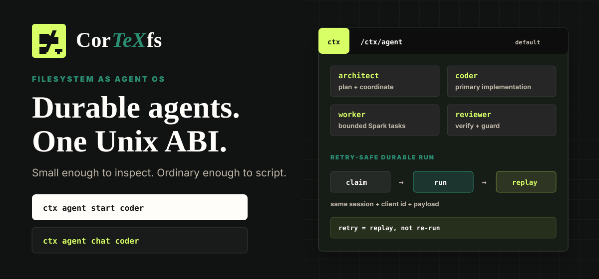
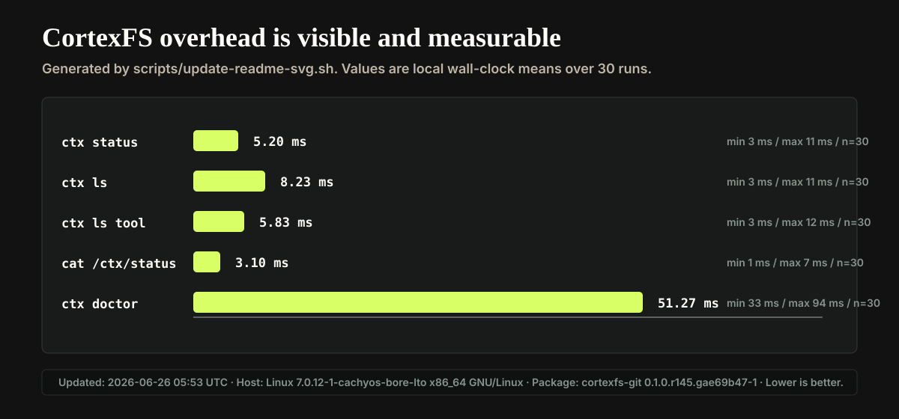
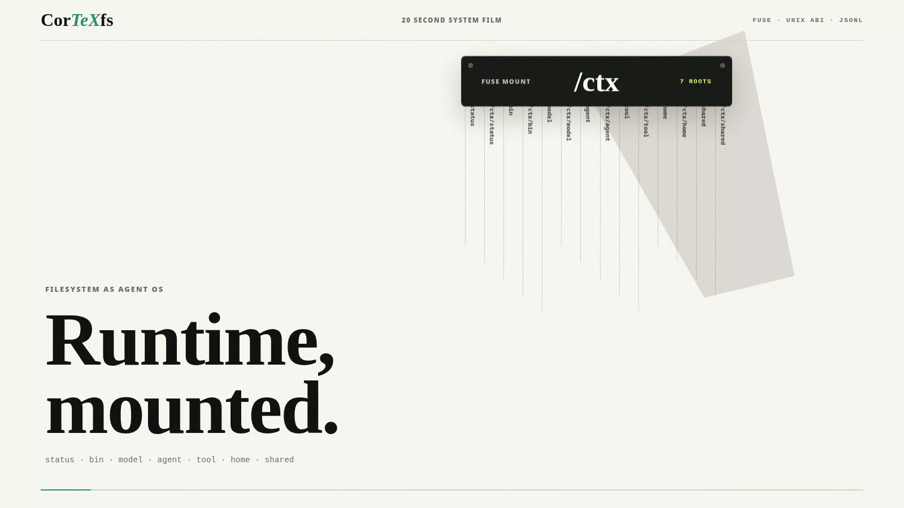
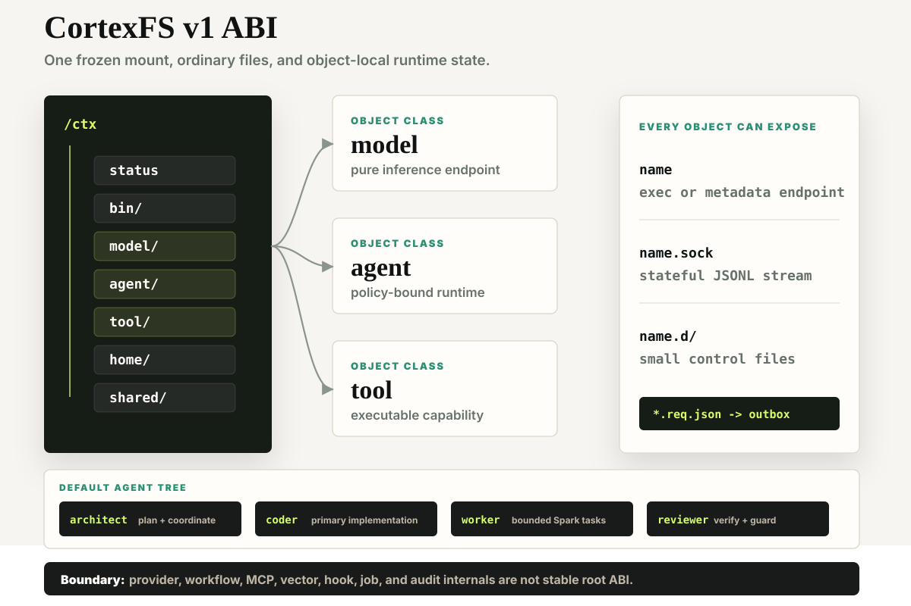

# CortexFS

<p align="center">
  
</p>

<p align="center">
  <a href="https://github.com/LIghtJUNction/cortexfs/actions/workflows/pages.yml"></a>
  <a href="https://lightjunction.github.io/cortexfs/"></a>
  <a href="https://crates.io/crates/cortexfs"></a>
  <a href="https://crates.io/crates/cortexfs-paths"></a>
  <a href="https://www.rust-lang.org/"></a>
  <a href="https://doc.rust-lang.org/edition-guide/rust-2024/"></a>
  <a href="https://www.kernel.org/doc/html/latest/filesystems/fuse.html"></a>
  <a href="https://github.com/LIghtJUNction/cortexfs/blob/main/Cargo.toml"></a>
</p>

<p align="center">
  <a href="https://lightjunction.github.io/cortexfs/">docs</a> · <a href="#quick-start">quick start</a> · <a href="docs/spec/README.md">specification</a> · <a href="docs/architecture.md">architecture</a> · <a href="docs/assets/cortexfs-demo.mp4">demo</a>
</p>

**One obvious tool path. Everything else stays inspectable.**

CortexFS is a FUSE filesystem for agent runtimes. It mounts models, agents,
tools, and durable sessions at `/ctx` — a small Unix filesystem interface you
can `ls`, `cat`, execute, secure, and audit.

- **One native tool by default.** Agents use `tsh`; it discovers only the
  policy-permitted tools in their filesystem view.
- **Host-owned execution.** The host serializes calls, rechecks authority, and
  returns a canonical result before an agent can continue.
- **Durable, inspectable facts.** Sessions keep ordinary `messages.jsonl` and
  `events.jsonl` history; prompt context can be rebuilt.
- **Small, explicit authority.** Static direct-native declarations never grant
  authority, and dynamic tool context never expands it.

## OpenAI-Compatible Model Access

CortexFS supports custom provider base URLs, so an OpenAI-compatible gateway can be used without changing the `/ctx` model ABI. [LMM API Gateway](https://api.lmm.best) is one available multi-model endpoint maintained by the CortexFS author. Configure it through host-side provider JSON and the system secret store as described in the [model ABI](docs/spec/model-abi.md#provider-presets).

API purchases help cover the model usage behind CortexFS development. Substantive issues, pull requests, and testing may also receive API credits; using LMM is optional and CortexFS remains provider-neutral.

---

## Install

On a supported systemd Linux distribution, install the downloaded source
snapshot locally, then inspect the mounted runtime:

```bash
curl -fsSL https://raw.githubusercontent.com/LIghtJUNction/cortexfs/main/scripts/install.sh | sh
ctx status
```

The installer audits prerequisites and asks for typed confirmation before each
mutation. Continue with the [quick start](#quick-start), or read the
[getting-started guide](docs/getting-started.md) for supported systems,
recovery, and the full runtime model.

For native packages, see the [multi-distribution packaging guide](https://github.com/LIghtJUNction/cortexfs/blob/main/docs/packaging.md)
for `.deb`, `.rpm`, Arch Linux packages, and portable tarballs.

For Telegram, Discord, Slack, and Feishu/Lark integration, see the
[multi-IM channel guide](docs/channels.md) and the normative
[channel ABI](docs/spec/channel-abi.md).

For integrations that need to derive CortexFS locations, use the published
[`cortexfs-paths`](https://crates.io/crates/cortexfs-paths) ABI crate and the
[path ABI guide](docs/paths.md); do not copy `/ctx` or host runtime path
literals into adapters.

[Live docs](https://lightjunction.github.io/cortexfs/) · [20-second demo](docs/assets/cortexfs-demo.mp4) · [specification](docs/spec/README.md)

## Project Introduction

<p align="center">
  <a href="https://www.youtube.com/watch?v=3BhCiHWbrUQ">
    
  </a>
</p>

<p align="center">
  <a href="https://www.youtube.com/watch?v=3BhCiHWbrUQ">Watch the CortexFS trailer on YouTube</a>
</p>

The stable shape is intentionally small:

```text
/ctx/status
/ctx/bin
/ctx/model
/ctx/agent
/ctx/tool
/ctx/home
/ctx/shared
```

For the normative ABI, start with the [specification](docs/spec/README.md)
and [architecture guide](docs/architecture.md). [docs/DESIGN.md](docs/DESIGN.md)
defines the visual system for CortexFS documentation and demos, not the ABI.

## An Agent Runtime You Can Open

CortexFS is an agent runtime project with a built-in execution engine and a
FUSE interface. A file manager, shell, or agent can inspect the same live work
view: runtime status, durable `messages.jsonl` and `events.jsonl`, rebuildable
context, and session state are ordinary paths rather than records hidden behind
one client.

That means an agent can retrieve history with ordinary file reads, while a
human can inspect the same session tree without entering the chat UI.
Conventional chat and CLI views, including Codex CLI, do not expose CortexFS's
durable state as a mounted shared filesystem. This is a filesystem
inspectability and composability distinction, not a claim that Codex lacks
other surfaces or persistence, nor a claim about model quality or CLI speed.

Model selection stays equally plain: `agent/<name>.d/model` is a text control
containing an alias such as `main`. The visible `/ctx/model/main` alias is
projected from the writable per-user backing symlink at
`/ctx/home/$(id -u)/model/main`; users retarget that backing path to select the
model behind the alias. The agent control file itself is not a symlink.

## Measured Runtime

The embedded chart includes a timestamped local service snapshot from the real
`/ctx` `cortexfs` FUSE mount with `default_permissions` and `allow_other`.
Snapshot values are local observations, not stable requirements or cross-tool
benchmarks.

The agent benchmark ran the five-item dataset once across `architect`, `coder`,
`reviewer`, and `worker` (20 requests total), with every role selecting model
route `main`:

- Runtime success: **100% (20/20)**; every benchmark session was archived.
- Exact-match accuracy: **20% (4/20)**. The current route completed every run,
  but often returned useful prose instead of the dataset's required exact short
  answer, so exact-match quality remains the clear weakness.
- End-to-end latency: **p50 6,737.81 ms**, **p95 11,432.03 ms** (20 samples;
  lower is better).
- Time to first token: **p50 5,573.45 ms**, **p95 10,315.34 ms** (20 samples;
  lower is better).
- Token reporting was available for only **1/20** requests, so token throughput
  is not representative and is intentionally not promoted here.

See the [sanitized benchmark provenance](docs/benchmarks/20260714-agent-summary.json)
and [Inspect benchmark guide](inspect_benchmark/README.md) for the recorded
inputs, preflight, lifecycle, and reproduction workflow.



## What It Feels Like

Start an agent, open its chat UI, and ask it to review a file in the mounted
workspace:

```text
ctx
/ctx/agent/coder
live chat

$ ctx agent start coder
agent coder ready

$ ctx agent chat coder
coder/default ❯ review /workspace/docs/DESIGN.md

tool
tsh -> fs.read {"path":"/workspace/docs/DESIGN.md"}

usage
input 912 / output 184
```

That is the intended surface: direct conversation with an agent file, direct
model calls behind it, and one stable tool path. The agent calls `tsh`, receives
the host-owned result, and then chooses its next action. `tsh` discovers,
loads, pins, and invokes dynamic tools through the same filesystem view instead
of exposing a sprawling native tool list.

<p align="center">
  <a href="docs/assets/cortexfs-demo.mp4">
    
  </a>
</p>

<p align="center">
  <a href="docs/assets/cortexfs-demo.mp4">Watch the MP4 demo</a>
  ·
  <a href="docs/assets/cortexfs-demo.webm">WebM</a>
  ·
  <a href="https://lightjunction.github.io/cortexfs/">Docs site</a>
</p>

At any time, attach to the agent terminal:

```bash
ctx agent watch coder
ctx agent attach coder
```

`watch` is read-only. `attach` joins the persistent `ctxterm -> tsh` terminal and
lets you see the tool shell exactly as the agent sees it.

## Mental Model

CortexFS has three executable object classes:

```text
model  pure inference endpoint
agent  policy-bound orchestrator process
tool   executable capability endpoint
```

The root stays small, the model tree stays provider-neutral, and agent context is
ordinary visible state instead of hidden SDK state. CortexFS is a way to peer
through the filesystem boundary and see what is happening inside agent software.



## Quick Start

On a current Arch-, Debian/Ubuntu-, Fedora/RHEL-, or openSUSE/SLES-family Linux
system booted with systemd and supported packages in its enabled repositories,
run:

```bash
curl -fsSL https://raw.githubusercontent.com/LIghtJUNction/cortexfs/main/scripts/install.sh | sh
```

The installer builds the downloaded source snapshot locally with `Cargo.lock`.
It audits systemd, FUSE, bubblewrap 0.10+, and Rust first, shows every planned
mutation, and proceeds only after exact typed confirmations. Re-running it
updates binaries and units without replacing CortexFS data, secrets, provider
configuration, or existing environment files. The first successful install
follows the system language and offers optional AI provider onboarding.

Then take a quick look around:

```bash
ctx status
ctx ls
ctx ls model
ctx ls agent
ctx ls tool
ctx file type tool/fs.read
ctx which tool tsh
```

For a local checkout without installing the package:

```bash
cargo run -p cortexfs --bin ctx -- bootstrap
cargo run -p cortexfs --bin ctx -- doctor
```

## Bootstrap A Programming Coder

`ctx bootstrap` creates four default agents with separate responsibilities:

```text
architect  plans and coordinates work
coder      implements the primary change
worker     handles bounded tasks with the Spark worker path
reviewer   independently verifies results and constraints
```

Start `coder` from the project checkout, wait for `ready`, then open the chat UI:

```bash
ctx bootstrap
ctx agent start coder --session default
ctx agent status coder
ctx agent chat coder
```

Audit the bootstrapped programming surface before asking for edits:

```bash
ctx agent status coder
ctx agent tools coder
ctx agent prompt coder
```

`ctxchat` is the replaceable file/socket-ABI chat UI; `ctx agent chat` delegates
to it for compatibility. `tsh` remains the agent-facing tool shell inside
`ctxterm`.

To add your own behavior, tools, and agent tree, use one package file instead
of hand-writing separate object manifests:

```bash
ctx install ./review-kit       # finds review-kit/cortexfs.toml
ctx agent start kit_reviewer
```

See [One-file Extensions](docs/extensions.md) for the complete 30-line example.

Ask clear coding tasks directly:

```text
fix the failing CortexFS test, edit the source, run focused verification, and report changed files
```

The bootstrapped `coder` prompt requires it to inspect `AGENTS.md`, check
`git status --short`, use `fs.replace` for surgical edits, run available
format/static-check/lint/test commands, inspect the diff, and finish with exact
verification evidence.

To verify the full bootstrapped programming path locally:

```bash
npm run bootstrap-coder:smoke
```

The smoke test bootstraps a temporary tree, starts `coder`, mounts a writable
temporary CortexFS checkout at `/workspace`, requires real `AGENTS.md` evidence,
writes a Rust test into the CortexFS source tree, reruns verification, inspects
`git diff`, commits the generated CortexFS source file without staging unrelated
dirty worktree changes, and checks that the final answer records changed files,
exact verification commands, and commit evidence.

## A First Walk Through `/ctx`

The root ABI is deliberately short:

```text
/ctx/
  status
  bin/
  model/
  agent/
  tool/
  home/
  shared/
```

Those top-level names are the contract. CortexFS does not add stable root
namespaces for provider, format, MCP, skill, memory, vector, workflow, job, hook,
or audit internals. Those concepts may exist as visible ordinary files, or as
implementation details behind tools, but they are not part of the root ABI.

Every executable object follows the same basic shape:

```text
name        exec or metadata endpoint
name.sock   stateful JSONL stream endpoint, only when supported
name.d/     small control files
```

Examples:

```text
/ctx/model/openai/gpt-5.6
/ctx/model/openai/gpt-5.6.d/driver
/ctx/agent/coder
/ctx/agent/coder.sock
/ctx/agent/coder.d/policy
/ctx/tool/tsh
/ctx/tool/tsh.d/schema
```

## Models

Models live under `/ctx/model/<provider>/<model>`:

```text
/ctx/model/debug/echo
/ctx/model/openai/gpt-5.6
/ctx/model/anthropic/claude-sonnet-5
/ctx/model/google/gemini-3.6-flash
```

They are executable files. You can call a model path directly for one-shot
inference:

```bash
/ctx/model/openai/gpt-5.6 "explain this error"
echo '{"messages":[{"role":"user","content":"hello"}]}' | /ctx/model/openai/gpt-5.6
ctx exec model/openai/gpt-5.6 "summarize README.md"
```

`/ctx/model/main` is the conventional default model alias. It is only a symlink,
not a privileged registry entry. Change the symlink to change the default model:

```bash
ln -sfn /ctx/model/openai/gpt-5.6 /ctx/home/$(id -u)/model/main
```

Provider API differences are handled below the filesystem ABI. CortexFS keeps
the visible model tree provider-neutral and API-format-neutral. API keys are not
stored in model files or process environments; long-lived provider keys belong in
the root-owned CortexFS system secret store.

## Agents

Agents live under `/ctx/agent`:

```text
/ctx/agent/coder
/ctx/agent/coder.sock
/ctx/agent/coder.d/
  owner
  uid
  gid
  groups
  perm
  label
  root
  cwd
  mount
  path
  model
  policy
  system.md
  prompt.template.md
```

`/ctx/agent/coder.sock` is the chat/session wakeup point. The packaged systemd
unit `cortexfs-agent@.socket` listens on the runtime socket and projects it back
into the CortexFS tree. A client connection can wake the agent runtime on
demand, instead of keeping every agent hot in the background.

Start an agent and open chat:

```bash
ctx agent start coder --session default
ctx agent chat coder
```

Agents are executable files too. Use chat for live conversation, or call an
agent path directly for a one-shot task:

```bash
/ctx/agent/coder "review /workspace/docs/DESIGN.md"
echo '{"task":"fix tests"}' | /ctx/agent/coder
ctx exec agent/coder "summarize the latest failure"
```

Use `ctx agent watch coder` to observe the persistent terminal, or
`ctx agent attach coder` when you explicitly want to join it and write to stdin.

`ctx agent start` launches the agent inside a lightweight sandbox. The default
path is:

```text
ctx agent start
  -> bwrap sandbox
  -> ctxterm
  -> tsh
```

`ctxterm` is the agent terminal emulator. It owns the PTY, keeps the terminal
observable, and exposes `watch` and `attach`. `tsh` is the agent-facing tool
shell that discovers tools, loads tool context, and invokes allowed
capabilities.

Session commands default to the latest or current session when `--session` is
omitted:

```bash
ctx send coder "summarize the current failure"
ctx history coder
ctx resume coder
ctx agent chat coder
ctx agent history coder
ctx agent output coder
ctx agent resume coder
ctx agent pack coder
```

An agent's runtime view is derived from control files plus Linux permissions:

```text
agent.d/root
agent.d/cwd
agent.d/mount
agent.d/path
agent.d/model
agent.d/perm
agent.d/policy
uid/gid/groups
mode bits
```

The coarse agent ceiling is visible like a Unix permission marker:

```bash
ls -l /ctx/agent/coder.d/perm
chmod 500 /ctx/agent/coder.d/perm   # r-x: read tools plus shell execution
```

Its owner triplet maps `r` to `fs.read`/`fs.list`/`fs.stat`, `w` to
`fs.write`/`fs.replace`, and `x` to shell or host-like terminal tools. It is an
additional ceiling; Linux mode bits, mounts, agent policy, and tool policy must
still allow every operation. The executable bit on `/ctx/agent/coder` remains
reserved for invoking the agent object itself.

CLI `--mount` arguments are validated, but runtime execution uses the derived
agent view. Terminal startup cannot bypass the policy and mount files that
define the agent.

## Tools And `tsh`

Tools live under `/ctx/tool` and are found through `CTX_PATH`, not shell `PATH`:

```sh
export CTX_ROOT=/ctx
export CTX_HOME="$CTX_ROOT/home/$(id -u)"
export CTX_PATH="$CTX_ROOT/tool:$CTX_HOME/tool"
export PATH="$CTX_ROOT/bin:$PATH"
```

`tsh` is the tool shell and the default native tool exposed to agents. Agents use
it to discover, load, pin, and run tools according to policy. A tool can be:

```text
discovered under /ctx/tool
loaded into the agent's current tool context
pinned so it stays available
invoked from tsh
called directly as a CLI-style CortexFS tool when policy allows it
```

For agent tool calls, the default remains one native entry point: `tsh`.
An agent may statically declare a small additional direct-native set, but every
such call still passes fresh `CTX_PATH`, agent policy, tool policy, mount, Linux
permission, schema, and nofollow checks. Dynamically discovered, loaded, pinned,
or cached tools remain `tsh`-only; cache state is prompt context, never
authority.

OpenAI programmatic tool calling is deliberately disabled until CortexFS has its
own continuation and audit ABI; ordinary native calls remain the only supported
provider tool path. See the [tool-policy ABI](docs/spec/tool-policy-abi.md#programmatic-tool-calling).

Human usage:

```bash
tsh tools
tsh which fs.read
tsh help fs.read
tsh load fs.read
```

Direct CLI-style usage:

```bash
/ctx/tool/fs.read '{"path":"README.md"}'
echo '{"path":"README.md"}' | /ctx/tool/fs.read
```

Standalone `tsh` can inspect visible tools and metadata. Tool execution runs
inside an agent terminal so CortexFS can apply policy, mounts, uid, gid, and
`CTX_PATH` together.

`ctx tool` is only a direct CLI entrypoint for allowlisted safe CortexFS core
tools such as `tsh.config`. Ordinary visible tools, plus authority-bearing core
tools such as `fs.write` and `shell.exec`, still run through `tsh` or an
authorized agent/runtime path.

```bash
ctx tool tsh.config
ctx tool tsh.config '{"max_loaded_tools":32}'
```

Inside `tsh`, `load` and `pin` load tool metadata into the agent context without
executing the tool binary or dynamic library:

```text
tsh> tools
tsh> load fs.read
tsh> pin bash
tsh> loads
```

New executable tool plugins should use a hash-bound `cortexfs.object/v2`
manifest with an object SemVer `version` and a Cargo-style
`compatibility.cortexfs` requirement. `cortexfs.object/v1` is legacy and omits
both fields. Installation remains new-object-only. Existing receipt-managed v1
or v2 objects accept a v2 replacement candidate through explicit lifecycle
commands. Plugins run through the normal `CTX_PATH` and policy path, and every
mutation requires the durable backing tree explicitly:

```bash
ctx object install --source "$CTX_SOURCE" tool.manifest.json --tier user
ctx object replace --source "$CTX_SOURCE" tool.manifest.json --tier user
ctx object upgrade --source "$CTX_SOURCE" tool.manifest.json --tier user
ctx object rollback --source "$CTX_SOURCE" old-tool.manifest.json --tier user
```

`replace`, `upgrade`, and `rollback` default to dry-run and require `--yes` to
apply. Replace has no version ordering and can migrate a v1 receipt; upgrade
requires a higher v2 version, while rollback requires a lower v2 manifest and
artifact supplied by the caller. CortexFS keeps no version history. Applied
replacement uses a same-filesystem stage, hides the old executable first, and
publishes the new executable last. It does not claim pair atomicity, stop or
start a runtime, grant policy, or create sockets; receipt conflicts preserve
foreign inodes and may leave auditable safety residue.

`/ctx`, `CTX_ROOT`, and `--root` describe the ABI projection, not a writable
installation target. `tsh.config` controls the visible tool metadata context size; pinned
entries are protected from automatic context eviction.

Tool metadata printed to a terminal is escaped so untrusted descriptions and
schemas cannot inject terminal control sequences.

## Files, Metadata, And xattrs

`ctx file` describes CortexFS file types and ABI metadata. It is not a
replacement for `cat`.

```bash
ctx file type tool/fs.read
ctx file check agent/coder.d/mount
ctx file info model/main
cat /ctx/status
```

Virtual files can expose xattrs for cost and origin hints before an agent reads
their contents:

```bash
getfattr -d /ctx/tool/fs.read
getfattr -n user.cortexfs.token_estimate /ctx/model/main
getfattr -n user.cortexfs.origin /ctx/model/helper
```

Common values:

```text
user.cortexfs.origin          virtual | disk | overlay
user.cortexfs.storage         memory | disk
user.cortexfs.token_estimate  approximate read cost
user.cortexfs.cache_bytes     cache size hint
user.cortexfs.cache_entries   cache entry count
```

## Sessions

Durable agent sessions live in the owning user's CortexFS home:

```text
/ctx/home/<uid>/agent/<agent>/session/<session>/
  messages.jsonl
  events.jsonl
  latest.md
  state
  cwd
  context/
  index/
```

`messages.jsonl` and `events.jsonl` are the durable raw history. `context/` is
a rebuildable prompt working set, not a replacement history store.

Socket requests are JSONL frames:

```jsonl
{"op":"send","id":"client-msg-id","session":"default","scope":"private","cwd":"/work","input":"hello"}
```

Within one session, retrying the same client `id` with the same input, scope,
and effective `cwd` replays the original `start` or final `done` without
running the agent again. Reusing that `id` with a conflicting payload is
rejected.

Scopes:

```text
private  current uid only, durable and resumable
shared   written to /ctx/shared/<name> according to policy
temp     temporary, no durable resume requirement
```

Clients should read `session/index/current`, `session/index/list`, and
`session/index/by-cwd/*` instead of maintaining a second hidden history store.

Session garbage collection is dry-run by default. `--yes` archives matching
live sessions outside the live session tree under
`$CTX_HOME/archived_sessions/<agent>/<session>/`; permanent deletion requires
the explicit `--delete --yes` combination. Use `--archive-dir /absolute/path`
to choose another non-overlapping archive root, or archive one session
immediately with `ctx agent session archive AGENT SESSION`.
`default`, the current session, every session whose plain bounded `state` is
`active`, and every explicit `--keep` name are always protected:

```bash
ctx agent session gc coder --dry-run
ctx agent session archive coder release-investigation
ctx agent session archive coder old-run --archive-dir /srv/cortexfs-archive
ctx agent session gc coder --dry-run --match '*' --keep release-investigation
ctx agent session gc coder --yes --match '*smoke*' --older-than-days 7 --keep release-investigation
ctx agent session gc coder --yes --archive-dir /srv/cortexfs-archive --match 'e2e-*'
ctx agent session gc coder --delete --dry-run --match '*'
ctx agent session gc coder --delete --yes --match '*smoke*' --older-than-days 30
```

Review the complete mode-specific dry-run list before adding `--yes`. Without
`--match`, GC uses conservative test-session patterns rather than treating
every session as disposable. `archived_sessions/` is outside the live session
tree and is not a new `/ctx` root ABI namespace. Archived directories preserve
the complete original session tree and raw JSONL files unchanged. There is no
restore command.

Provider failures are durable session facts. When a run terminates with an
error, CortexFS records the original provider `error` frame followed by
`done(status=error)` in `events.jsonl` and sets `state` to `error`. This terminal
history remains available to `ctx agent resume` even when no assistant message
was produced.

## Policy Model

Policy v0 is a minimal allowlist:

```text
allow coder_t tool:tsh execute
allow coder_t tool:fs.read execute
allow coder_t model:openai/gpt-5.6 use
allow coder_t shared:project-a read
allow coder_t shared:project-a write
```

There is no explicit deny, glob, priority, inheritance, variable expansion, or
path matching. Default is deny.

The security stack is layered:

```text
Linux uid/gid/groups
file mode bits
agent permission ceiling
chroot + bind mounts
CortexFS label
agent policy
tool/model policy
```

## Common Commands

```bash
ctx status
ctx doctor
ctx env
ctx root
ctx ls
ctx ls /
ctx ls home
ctx ls model
ctx ls agent
ctx ls tool
ctx which tool fs.read
ctx path shared project-a
ctx file type tool/fs.read
ctx file check agent/coder.d/policy
ctx agent ps
ctx agent start coder
ctx agent chat coder
ctx agent watch coder
ctx agent attach coder
ctx agent history coder
ctx agent output coder
```

## Development

Build and test (same contract as `.pre-commit-config.yaml` and the Linux CI gate):

```bash
cargo fmt --all -- --check
cargo check --locked --workspace --all-targets --all-features
cargo clippy --locked --workspace --all-targets --all-features -- -D warnings
cargo test --locked --workspace --all-targets --all-features
```

Docs production build (independent of GitHub Pages deployment):

```bash
cd docs-site && bun install --frozen-lockfile && bun run build
```

### CI quality gate

Workflow: [`.github/workflows/ci.yml`](.github/workflows/ci.yml) (name **CI**).

| Required check name | Job | What it runs |
| --- | --- | --- |
| `CI / rust` | `rust` | Ubuntu, **latest stable** Rust: the four Cargo commands above (`--locked` / `--workspace` / `--all-targets` / `--all-features`) |
| `CI / docs` | `docs` | `docs-site` Bun install + Docusaurus production build |

After these checks are green on `main`, enable them as required branch-protection checks. Privileged FUSE mounts, live providers, and systemd smoke tests stay out of this gate.

Run the deterministic agent tool-loop smoke without a live model:

```bash
npm run agent-tool-loop:smoke
```

Regenerate README images and the local runtime chart. Pass an Inspect summary
to include agent benchmark results:

```bash
BENCHMARK_SUMMARY=docs/benchmarks/20260714-agent-summary.json \
  scripts/update-readme-svg.sh
```

Verus proof sources live under `proofs/verus/`. They are opt-in and do not
change the runtime Cargo workspace. Install the upstream `verus` binary from
<https://github.com/verus-lang/verus> and run:

```bash
scripts/verify-verus.sh
```

Current proofs cover the stable object-name ABI predicate; see
[docs/proofs/verus.md](docs/proofs/verus.md).

## External references

### Projects
- [tursodatabase/agentfs](https://github.com/tursodatabase/agentfs)
- [modelcontextprotocol/filesystem server](https://github.com/modelcontextprotocol/servers/tree/main/src/filesystem)
- [j0hanz/filesystem-mcp](https://github.com/j0hanz/filesystem-mcp)
- [rust-mcp-stack/rust-mcp-filesystem](https://github.com/rust-mcp-stack/rust-mcp-filesystem)
- [mark3labs/mcp-filesystem-server](https://github.com/mark3labs/mcp-filesystem-server)
- [cyanheads/filesystem-mcp-server](https://github.com/cyanheads/filesystem-mcp-server)
- [TexasFortress-AI/rs_filesystem](https://github.com/TexasFortress-AI/rs_filesystem)
- [colinrozzi/fs-mcp-server](https://github.com/colinrozzi/fs-mcp-server)
- [corporatepiyush/mcp-filesystem-rust](https://github.com/corporatepiyush/mcp-filesystem-rust)
- [rawr-ai/mcp-filesystem](https://github.com/rawr-ai/mcp-filesystem)
- [safurrier/mcp-filesystem](https://github.com/safurrier/mcp-filesystem)
- [SylphxAI/filesystem-mcp](https://github.com/SylphxAI/filesystem-mcp)
- [QuantGeekDev/mcp-filesystem](https://github.com/QuantGeekDev/mcp-filesystem)
- [efforthye/fast-filesystem-mcp](https://github.com/efforthye/fast-filesystem-mcp)
- [lileeei/sand-mcp-fs](https://github.com/lileeei/sand-mcp-fs)
- [proofmath-owner/ai-filesystem-mcp](https://github.com/proofmath-owner/ai-filesystem-mcp)
- [github/github-mcp-server](https://github.com/github/github-mcp-server)
- [conikeec/mcpr](https://github.com/conikeec/mcpr)
- [strawgate/filesystem-operations-mcp](https://github.com/strawgate/filesystem-operations-mcp)
- [webconsulting/mcp-server-wsl-filesystem](https://github.com/webconsulting/mcp-server-wsl-filesystem)
- [avelino/mcp](https://github.com/avelino/mcp)
- [wonker007/surgicalfs-mcpserver](https://github.com/wonker007/surgicalfs-mcpserver)

### CortexFS MCP

- CortexFS PR:
  - [#89](https://github.com/LIghtJUNction/cortexfs/pull/89)
  - [#88](https://github.com/LIghtJUNction/cortexfs/pull/88)
  - [#87](https://github.com/LIghtJUNction/cortexfs/pull/87)
- MCP PR/Issue references moved to source comments:
  - `crates/cortexfs-tool-sdk/src/lib.rs`

### Spec references
- [Model Context Protocol (2025-11-25)](https://modelcontextprotocol.io/specification/2025-11-25/basic/transports)
- Historical compatibility references:
  - [Model Context Protocol (2025-06-18)](https://modelcontextprotocol.io/specification/2025-06-18/basic/transports)
  - [Model Context Protocol (2025-03-26)](https://modelcontextprotocol.io/specification/2025-03-26/basic/transports)
- [Linux FUSE documentation](https://www.kernel.org/doc/html/latest/filesystems/fuse/fuse.html)
- [mount.fuse page](https://manpages.ubuntu.com/manpages/jammy/man8/mount.fuse.8.html)
- [MCP security and authorization](https://modelcontextprotocol.io/docs/tutorials/security/authorization)
